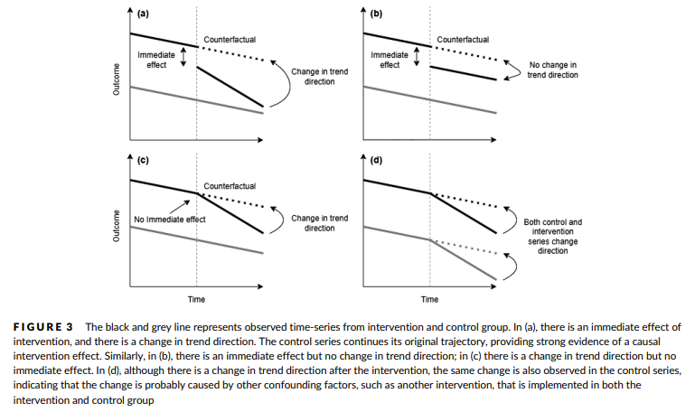

### Real Data Example: Addiction Research

### Participants

- Mattes Grundmann
- Oya Bazer
- Jakob Zschocke

### Abstract

While Randomized Controlled Trials (RCTs) are the gold standard for causal inference, these are often not feasible in addiction research for ethical and logistic reasons; for example, when studying the impact of smoking on cancer. 
Instead, observational data from real-world settings are increasingly being used to inform clinical decisions and public health policies. This paper presents the framework for potential outcomes for causal inference and summarizes best practices in causal analysis for observational data. Among them: Matching, Inverse Probability Weighting (IPW), and Interrupted Time-Series Analysis (ITSA). 
These methods will be explained using examples from addiction research, and the resulting results will be compared.

### Background
#### Matching 
The goal of matching is to establish the balance between treatment and control group, as it generally is in RTCs. Specificly, it targets similar distributions of all observed covariates in both treatment and control group. A variant of matching is one-to-one matching which matches each individual in the treatment group with an individual in the control group based on a propensity score. This score represents the probability of receiving the treatment, measured by all variables that can influence it. It is often estimated using logistic regression with pretreatment covariates. Unmatched individuals will be excluded. After matching, the Average Treatment effect among the Treated (ATT) can now be calculated using simple regression.

#### Inverse Probability Weighting (IPTW)
Auch beim IPTW ist es das Ziel, ein Gleichgewicht zwischen der Treatment und Kontrollgruppe herzustellen. Hierzu werden verschiedene Gewichtungen verwendet. Dabei werden gewichtete Daten als eine Art imaginäre Population verstanden, bei der der einzige Unterschied zwischen den Gruppen darin besteht, ob das Treatment erhalten wurde oder nicht. Das Gewicht für Individuen der Treatment Gruppe ist die Inverse ihrer Propensity Scores, also 1 geteilt durch den Propensity Score. Das Gewicht für Individuen der Kontrollgruppe berechnet sich dagegen aus der Inverse von 1 minus des Propensity Scores. Diese Gewichte werden als unstabilisierte Gewichte bezeichnet. Der Grund dafür ist, wenn ein Individuum eine geringe Wahrscheinlichkeit hat, ein Treatment zu bekommen, am Ende das Treatment aber bekommt führt dies dazu, dass dieses Individuum ein hohes Gewicht hat und somit die Varianz des geschätzten Kausalen Effekts wesentlich erhöht. In der hier behandelten Studie wurde das IPTW anhand des Beispiels "Rauchen und psychologische Störung" illustriert. Dies hat gezeigt, dass das IPTW zu einer deutlichen Verbesserung des Gleichgewichts zwischen den Gruppen geführt hat. Der kausale Effekt des Treatments kann nun geschätzt werden. 

#### Instrumental Variable Method

Sowohl das Matching, als auch die IPTW-Methode können zwar zur Prüfung des Confoundings von gemessenen Kovariaten genutzt werden, gehen aber davon aus, dass kein ungemessenes Confounding existiert. Diese Annahme ist nicht überprüfbar und wird sehr wahrscheinlich verletzt, da nicht alle Störvariablen gemessen und in Matching- und Gewichtungsverfahren aufgenommen werden könnnen. Um das ungemessene Confounding zu kontrollieren, wurde die Instrumental Variable Method eingeführt:
Bei dieser Methode wird eine Intrumentalvariable gesucht, welche (i) einen direkten kausalen Effekt auf das Treatment hat, (ii) keinen direkten kausalen Effekt auf das Ergebnis hat und (iii) das Ergebnis nicht durch andere Variablen als das Treatment beinflusst. Dies wird durch die folgende Grafik veranschaulicht. 

Die Methode zur Bestimmmung eines kausalen Effektes funktioniert nach dem folgenden Prinzip: 
Ist eine Instrumentalvariable identifiziert worden, kann über eine Regression (kleinste Quadrate Methode) für jeden Induviduum die counfounding freie Ausprägung des Treatments geschätzt werden, auf Basis derer durch eine weitere Regression der kausale Effekt auf das Ergebnis geschätzt werden kann. Das Ausfindigmachen einer Instrumentalvariable stellt die größte Schwierigkeit dieser Methode dar. 

#### Interrupted Time-Series Analysis

Unter Verwendung von Daten aus wiederholten Beobachtungen eines Ergebnisses wird in einer unterbrochenen Zeitreihenanalyse (ITSA) die Entwicklung des Ergebnisses vor und nach der Intervention.
Dies kann konzeptualisiert werden auf der Grundlage des kontrafaktischen Rahmens als Vergleich dessen was ohne die Intervention geschehen wäre (ein kontrafaktisches Szenario) mit dem, was nach einer Intervention beobachtet wurde. 
Eine Kontrollreihe, bei der die Intervention nicht durchgeführt wird, kann um die kausale Schlussfolgerung zu verstärken.

Es ist auch wichtig, dass eine vergleichbare Kontrollreihe aus einer Population ausgewählt wird, die derjenigen, die der Intervention ausgesetzt ist, möglichst ähnlich ist
mit Ausnahme der Tatsache, dass die eine die Intervention erhält und eine nicht. Die Kontrollreihe kann beispielsweise von einem anderen Ort mit ähnlichen Bevölkerungsmerkmalen stammen, oder sie kann aus dem historischen Trend in derselben Population stammen.

Eine unterbrochene Zeitreihenanalyse mit Kontrolle basiert häufig auf das Regressionsmodell:

Yt = &beta;0 + &beta;1(time) + &beta;2(post intervention) + &beta;3(post intervention &times; time)  + &beta;4(group) + &beta;5(group &times; time) + &beta;6(group &times; post intervention) + &beta;7(time &times; post intervention &times; group) + &epsilon;t

### Results & Interpretation

### Current State and Call for Extension

- [ ] Briefly summarize the state of your data product as of the end of the course
- [ ] Briefly summarize what could be added or improved in the future

## Organization of the Repo

We'd recommend you to organize your repo as follows.

* Include figures (`.jpg`, `.png`, ...) in a subdirectory called `figures/`, see [this example](figures/logo.png)
* Include data files (`.csv`, `.rda`, ...) in a subdirectory called `data/`, see [this example](data/experiment_data_counterfactual.rda)
* Include your R code (`.R` files) in a subdirectory called `R`, see [this example](R/my_function.R)
* In case you use quarto for your data product, include your `.qmd` files here, see [this example](demo_repo.qmd)

These basic recommendations are intended to give you a bit structure. You can deviate from them as you like but please make sure others should be able to understand what you did.
