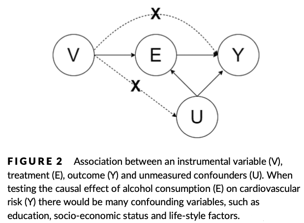

### Real Data Example: Addiction Research

### Participants

- Mattes Grundmann
- Oya Bazer
- Jakob Zschocke

### Abstract

Randomized controlled trials (RCTs) are the gold standard for making causal inferences,
but RCTs are often not feasible in addiction research for ethical and logistic reasons.
Observational data from real-world settings have been increasingly used to guide clinical
decisions and public health policies. This paper introduces the potential outcomes framework for causal inference and summarizes well-established causal analysis methods for observational data, including matching, inverse probability treatment weighting, the
instrumental variable method and interrupted time-series analysis with controls. It provides examples in addiction research and guidance and analysis codes for conducting these analyses with example data sets.

- [ ] You can upload and include figures, too

### Background
### Explanation Matching and Inverse Probability Weighting
Die hier behandelten Methoden sind das Matching & Inverse Probability Weighting. Grundsätzlich sind Randomisierte Experimente der Goldstandard um kausale Rückschlüsse ziehen zu können. Doch diese sind in der Realität häufig schwierig durchführbar. Nun gibt es verschiedene Methoden, um mit nicht randomisierten observationellen Daten umzugehen. Zwei dieser Methoden werden hier behandelt: Inverse Probability Weighting und Matching. 
#### Matching 
Ziel des Matchings ist es, ein Gleichgewicht zwischen der Behandlungs- und der Kontrollgruppe herzustellen, so wie es in RCTs grundsätzlich vorhanden ist. Dieses Gleichgewicht bedeutet konkret, dass die Verteilungen aller beobachteten Kovariaten in beiden Gruppen ähnlich sind. Eine Variante des Matchings ist das One-to-one Matching. Diese Methode stellt jedem Individuum der Treatment Gruppe ein passendes Individuum der Kontrollgruppe gegenüber. Dies geschieht anhand eines Propensity Scores. Dieser stellt die Wahrscheinlichkeit dar, das Treatment zu bekommen, gemessen an allen Variablen, die darauf Einfluss nehmen können. In der Case Study stellt das Rauchen beispielhaft das Treatment dar. Die beiden Gruppen "Raucher" und "nicht-Raucher" unterscheiden sich jedoch verschiedener Variablen, z.B. des Schulabschlusses. Durch das Matching wurde jeder Person ein Individuum mit einem ähnlichen Propensity Score gegenüber gestellt. Unmatched Individuen wurden ausgeschlossen. Die beiden Gruppen weisen nun deutliche geringere Unterschiede in den einzelnen Variablen wie z.B. Schulabschluss auf. Nachdem das Matching erfolgreich war, kann nun mittels der einfachen Regression, der "Average Treatment Effect of the Treated" berechnet werden.  

#### Inverse Probability Weighting (IPTW)
Auch beim IPTW ist es das Ziel, ein Gleichgewicht zwischen der Treatment und Kontrollgruppe herzustellen. Hierzu werden verschiedene Gewichtungen verwendet. Dabei werden gewichtete Daten als eine Art imaginäre Population verstanden, bei der der einzige Unterschied zwischen den Gruppen darin besteht, ob das Treatment erhalten wurde oder nicht. Das Gewicht für Individuen der Treatment Gruppe ist die Inverse ihrer Propensity Scores, also 1 geteilt durch den Propensity Score. Das Gewicht für Individuen der Kontrollgruppe berechnet sich dagegen aus der Inverse von 1 minus des Propensity Scores. Diese Gewichte werden als unstabilisierte Gewichte bezeichnet. Der Grund dafür ist, wenn ein Individuum eine geringe Wahrscheinlichkeit hat, ein Treatment zu bekommen, am Ende das Treatment aber bekommt führt dies dazu, dass dieses Individuum ein hohes Gewicht hat und somit die Varianz des geschätzten Kausalen Effekts wesentlich erhöht. In der hier behandelten Studie wurde das IPTW anhand des Beispiels "Rauchen und psychologische Störung" illustriert. Dies hat gezeigt, dass das IPTW zu einer deutlichen Verbesserung des Gleichgewichts zwischen den Gruppen geführt hat. Der kausale Effekt des Treatments kann nun geschätzt werden. 

#### Instrumental Variable Method

Sowohl das Matching, als auch die IPTW-Methode können zwar zur Prüfung des Confoundings von gemessenen Kovariaten genutzt werden, gehen aber davon aus, dass kein ungemessenes Confounding existiert. Diese Annahme ist nicht überprüfbar und wird sehr wahrscheinlich verletzt, da nicht alle Störvariablen gemessen und in Matching- und Gewichtungsverfahren aufgenommen werden könnnen. Um das ungemessene Confounding zu kontrollieren, wurde die Instrumental Variable Method eingeführt:
Bei dieser Methode wird eine Intrumentalvariable gesucht, welche (i) einen direkten kausalen Effekt auf das Treatment hat, (ii) keinen direkten kausalen Effekt auf das Ergebnis hat und (iii) das Ergebnis nicht durch andere Variablen als das Treatment beinflusst. Dies wird durch die folgende Grafik veranschaulicht. 

### Results & Interpretation

### Current State and Call for Extension

- [ ] Briefly summarize the state of your data product as of the end of the course
- [ ] Briefly summarize what could be added or improved in the future

## Organization of the Repo

We'd recommend you to organize your repo as follows.

* Include figures (`.jpg`, `.png`, ...) in a subdirectory called `figures/`, see [this example](figures/logo.png)
* Include data files (`.csv`, `.rda`, ...) in a subdirectory called `data/`, see [this example](data/experiment_data_counterfactual.rda)
* Include your R code (`.R` files) in a subdirectory called `R`, see [this example](R/my_function.R)
* In case you use quarto for your data product, include your `.qmd` files here, see [this example](demo_repo.qmd)

These basic recommendations are intended to give you a bit structure. You can deviate from them as you like but please make sure others should be able to understand what you did.
